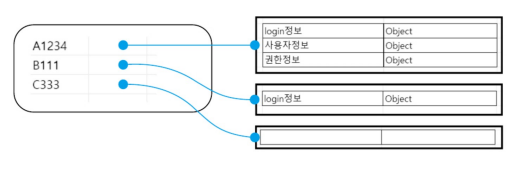
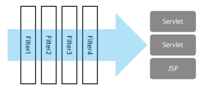

# 3장 세션/쿠키/필터/리스너

> ## 세션과 필터

### 웹의 무상태(stateless)란? 
클라이언트와 서버 관계에서 서버가 클라이언트의 상태를 보존하지 않음을 의미한다.  

- 장점 : 적은 자원으로 여러 개의 요청을 처리할 수 있어 서버 확장성이 높아 대량의 트래픽 발생 시에도 수월하게 대처할 수 있음. 
- 단점 : 클라이언트 상태를 기록하지 않기 때문에 과거 방문 기록을 추적하는 기법(session tracking)이 필요하게 된다. 

### 세션 트래킹 

HTTP에서 세션 트래킹은 쿠키(Cookie)를 이용한다.
> 쿠키는 문자열로 만들어진 데이터 조각으로 서버와 브라우저 사이 요청이나 응답 시 주고받는 형태로 사용됨. 기본적인 형태는 name / value 의 구조이다. 개발자 도구를 통해 확인 가능함.

서버에서 쿠키를 발행하는 것은 서버에서 자동으로 발행되는 방식, 개발자가 코드를 통해 직접 발행하는 방식이 존재한다.
 

> - 서버에서 자동 생성 : 응답 메시지를 작성할 때 정해진 쿠키가 없는 경우 자동으로 발행 (WAS에서 발행되며 이름은 WAS마다 고유한 쿠키를 생성 / Tomcat의 경우 'JSESSIONID')
>> - 기본적으로 브라우저 메모리상에 보관 ~> 브라우저 종료시 쿠키 삭제됨
>> - 경로는 '/'로 지정된다.
> - 개발자가 생성 : 이름, 유효기간, 경로나 도메인 등을 지정할 수 있다. 단, 반드시 직접 응답에 추가해야 한다.

### 서블릿 컨텍스트와 세션 저장소

서버는 톰캣이라고 칭하고 설명을 진행하겠다. 
 
> 서블릿 컨텍스트
> 
하나의 톰캣은 여러 개의 웹 애플리케이션을 별도의 도메인으로 분리해서 운영하며 실행할 수 있다.각 웹 애플리케이션은 자신만의 고유 메모리 영역을 하나 생성해 서블릿이나 JSP 등 인스턴스로 만들어 서비스를 제공하는데 이 영역을 서블릿 API에서 서블릿 컨텍스트라고 한다.

> 세션 저장소

 각 웹 앱을 생성할 때 톰캣이 발행하는 쿠키들(개발자 생성 포함)을 관리하기 위한 메모리 영역. 기본적으로 'key'/'value'를 보관하는 구조이다.

> >발행된 쿠키들의 정보를 보관하는 역할을 하지만, 새로운 JSESSIONID쿠키가 만들어 질 때 마다 메모리 공간을 차지해야 한다는 문제가 있다. 이 문제를 해결하기 위해 session-timeout과 같은 방식으로 주기적으로 세션 저장소를 조사하면서 사용하지 않는 값들을 정리한다.
 
### 사용 예시

getSession() 메소드로 각각의 JSESSIONID의 공간에 접근하여  정보들을 이용할 수 있다. 
그림의 'A1234','B1111'은 자신이 사용하는 공간에 login 정보를 의미한다.

> ### 세션을 이용한 로그인 체크
세션을 이용한 로그인 체크 시나리오
1. 사용자가 로그에 성공하면 HttpSession을 이용해 해당 사용자의 세션 컨텍스트에 특정한 객체를 key와 함께 저장한다.
2. 로그인 체크가 필요한 컨트롤러에서는 현재 사용자의 공간에 지정된 이름(key)으로 객체가 저장되어 있는지 확인한다. 존재한다면 로그인한 사용자로 간주, 그렇지 않으면 로그인 페이지로 이동한다.

> ### 필터를 이용한 로그인 체크

로그인 여부를 체크해야 하는 컨트롤러마다 동일한 체크 로직을 작성하면 같은 코드가 반복된다. 
이러한 문제를 필터(Servlet Filter)라는 것을 이용하여 처리한다.

**필터(Servlet Filter)란?** 

특정 서블릿이나 JSP 등에 도달하는 과정에서 필터링 하는 역할을 위해 존재하는 서블릿 API의 특별한 객체로 `@WebFilter` 어노테이션을 사용해 특정한 경로에 접근할 때 필터가 작동하도록 설계하여 동일한 로직을 필터로 분리할 수 있다.

이를 통해 로그인이 필요한 페이지, 한글 처리가 필요한 페이지를 Filter를 통해 일괄적으로 적용함으로서 코드를 간단하게 작성하고 관리할 수 있다.